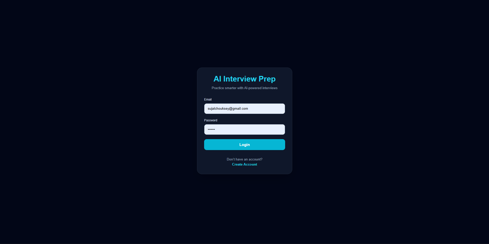
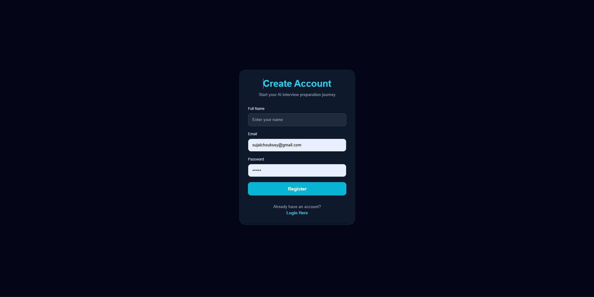
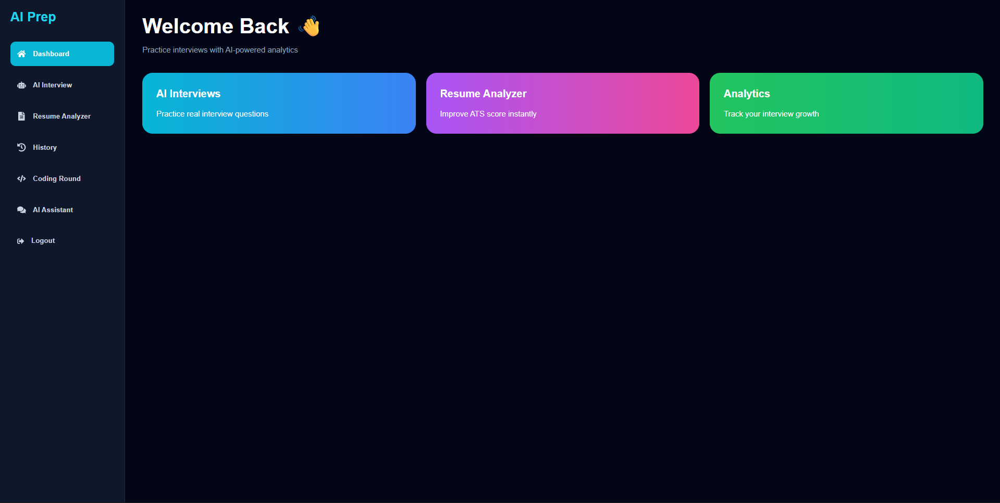
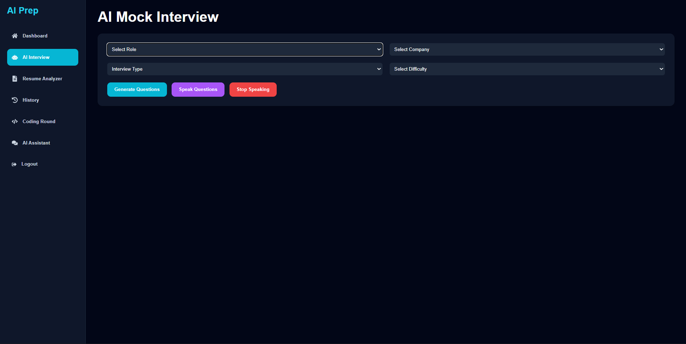
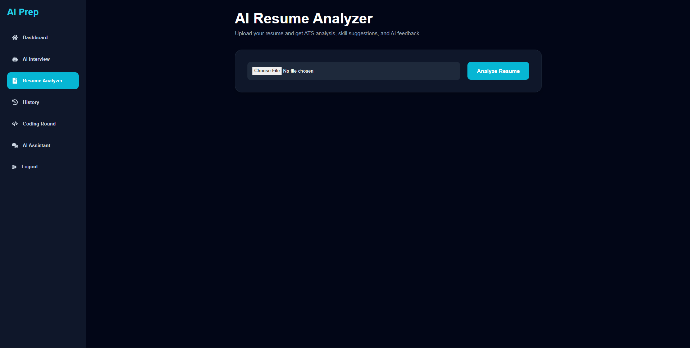
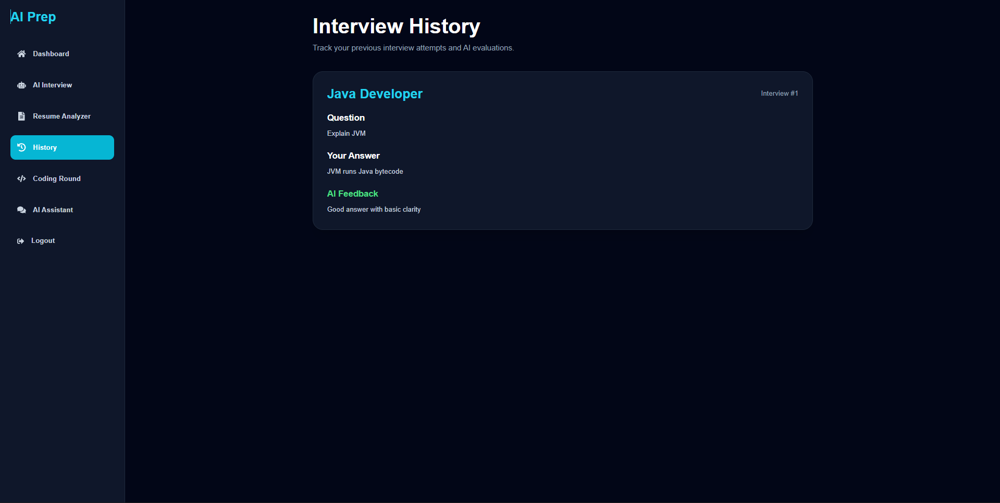
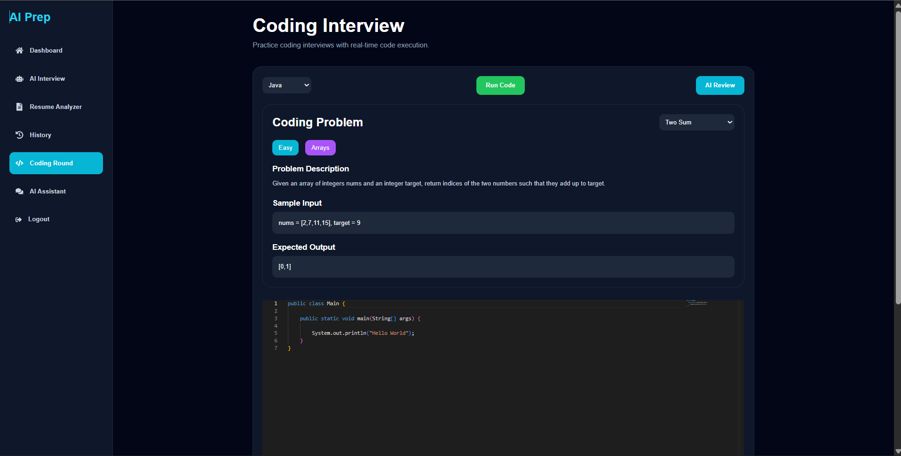
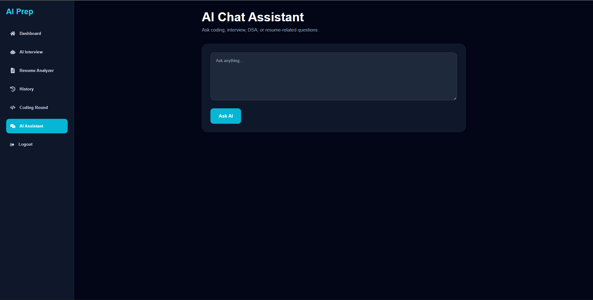

# AI Interview Preparation Platform

An AI-powered full-stack interview preparation platform built using React, Spring Boot, MySQL, JWT Authentication, and Ollama LLM.

This platform helps students prepare for:
- Technical Interviews
- HR Interviews
- Coding Rounds
- Resume Screening
- Company-Specific Placements

---

# Features

## Authentication System
- User Registration
- Secure Login
- JWT Authentication
- Protected Routes

---

## AI Mock Interview
- AI-generated interview questions
- Company-specific interview preparation
- HR / DSA / System Design rounds
- Voice-based interview support

---

## AI Answer Evaluation
- AI feedback generation
- Score analysis
- Strengths & weaknesses detection
- Improvement suggestions

---

## Resume Analyzer
- PDF resume upload
- ATS score analysis
- Skill extraction
- Resume improvement suggestions

---

## Coding Interview Platform
- Monaco Code Editor
- Multi-language support
- Real-time code execution
- AI code review
- Optimization suggestions

---

## AI Chat Assistant
- Coding help
- DSA guidance
- Interview preparation support
- Resume assistance

---

## Analytics Dashboard
- Interview history tracking
- Performance analytics
- Charts & statistics
- Progress monitoring

---

# Tech Stack

## Frontend
- React.js
- Tailwind CSS
- Recharts
- Monaco Editor
- Axios

---

## Backend
- Spring Boot
- Spring Security
- JWT Authentication
- REST APIs

---

## Database
- MySQL

---

## AI Integration
- Ollama
- Llama 3

---

# Project Architecture

Frontend (React)
↓
REST API Calls
↓
Spring Boot Backend
↓
MySQL Database + Ollama AI

---

# Installation & Setup

## Clone Repository

```bash
git clone https://github.com/sujal-09/ai-interview-preparation-system.git
```

---

## Frontend Setup

```bash
cd frontend
npm install
npm start
```

---

## Backend Setup

```bash
cd backend
mvn spring-boot:run
```

---

## Run Ollama

```bash
ollama run llama3
```

---

# Application Screenshots

---

## Login Page

Modern authentication UI with JWT-based secure login.



---

## Register Page

New users can create accounts securely.



---

## Dashboard

Central dashboard with analytics and navigation modules.



---

## AI Mock Interview

Generate AI-powered interview questions with company-specific preparation.



---

## Resume Analyzer

Upload resumes and receive ATS analysis with AI feedback.



---

## Interview History

Track previous interviews, answers, and AI evaluations.



---

## Coding Interview Platform

Real-time coding environment with Monaco Editor and AI review.



---

## AI Chat Assistant

AI assistant for coding help, DSA guidance, and interview preparation.



---

# Future Scope

- AI Proctoring System
- Webcam Monitoring
- Hidden Test Cases
- Video Interview Recording
- AI Confidence Analysis
- Cloud Deployment

---

# Author

Sujal Chouksey

---

# License

This project is developed for educational purposes.